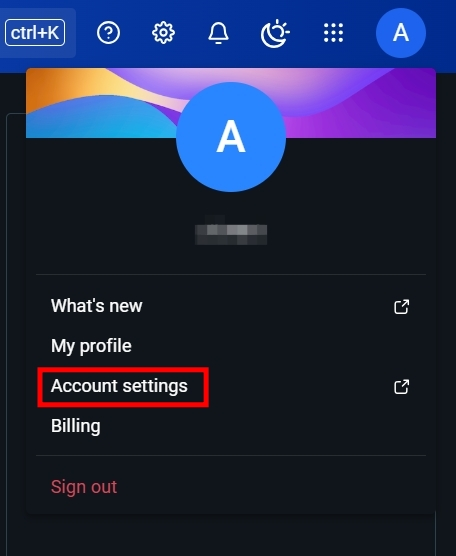
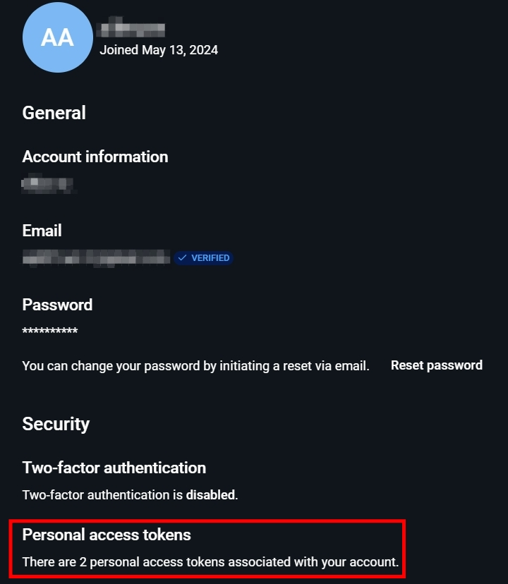
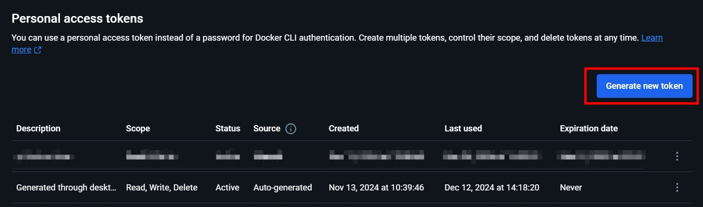
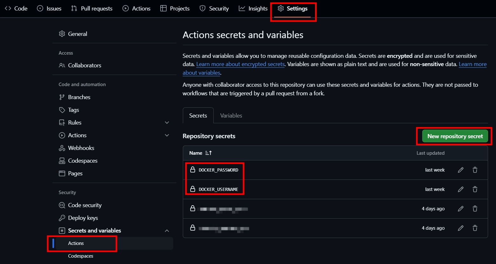

## 前言

## 步驟

### 取得 DockerHub 的 Personal access token

DockerHub 新增 Personal access token。 </br>

 </br>

 </br>

 </br>

### 設定 GitHub Repository secrets

GitHub 設定 DockerHub 的使用者名稱以及 Personal access token。 </br>

 </br>

### 設定 Repository Workflow

在 Repository 根目錄中的 .gethub\workflows\deploy.yaml 加入以下流程。 </br>
該專案使用 docker-compose 所以直接將整個 docker-compose 推送到 DockerHub。

```yaml
name: Build and Push Docker Images using Docker Compose

on:
  push:
    branches:
    - main

jobs:
  build:
    runs-on: ubuntu-latest

    steps:
    - name: Checkout code
      uses: actions/checkout@v2

    - name: Set up Docker Buildx
      uses: docker/setup-buildx-action@v2

    - name: Log in to Docker Hub
      uses: docker/login-action@v2
      with:
        username: ${{ secrets.DOCKER_USERNAME }} # DockerHub 使用者名稱
        password: ${{ secrets.DOCKER_PASSWORD }} # DockerHub Personal access token

    - name: Install docker-compose
      run: |
        sudo apt-get update
        sudo apt-get install -y docker-compose

    - name: Build and push Docker images
      run: |
        cd src # 將工作目錄移到有 docker-compose.yml 所在的 src 資料夾
        docker-compose -f docker-compose.yml build
        docker-compose push
```