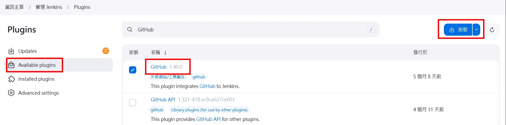

## 前言

透過 GitHub Personal access tokens 讓 Jenkins 可以透過連結取得 Repository。

## 步驟

### 在 Jenkins 安裝 GitHub Plugins

進入 Plugins 安裝 GitHub。

  

  

### 新增 Pipeline 並設定 GitHub URL

新增 Pipeline 作業。

  

設定 Build Triggers，勾選 GitHub hook trigger for GITScm polling。

  

設定 Repository URL，連結格式為 https://\<personal_access_token\>@github.com/\<repository_name\>.git。 
\<personal_access_token\> 需在 GitHub 產生並取得。

  

或是新增 Credentials 將 Token 資訊儲存在 Jenkins 中。Username 為 GitHub 用戶名稱，Password 為 GitHub Personal access tokens。

  

  

指定 Repository 的分支。

  

### (補充) 產生新的 GitHub Personal access tokens

進入使用者選單下的 Settings > Developer settings。

  

產生 Personal access tokens。

  

設定 Personal access tokens 可使用的範圍。

  

## 參考

- [建立新的Jenkins任務並與Github連結](https://ithelp.ithome.com.tw/articles/10267686)
