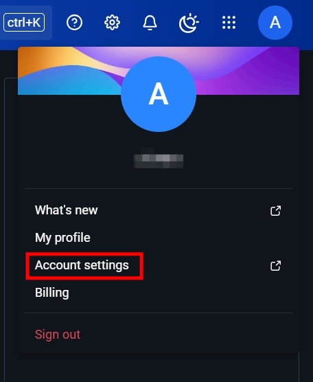

## 前言

Kaniko 是一個在 Kubernetes 環境下建構 Docker 映像的工具，它不需要 Docker 守護進程，並且可以更安全地在容器中執行。

## 步驟

### 取得 DockerHub 的 Personal access token

DockerHub 推出了 Personal access token 來取代密碼認證。這是更安全且推薦的方式來驗證與 DockerHub 互動。 </br>

 </br>

 </br>

 </br>

### 登錄 Docker 並創建配置文件

config.json 文件會存放於 ~/.docker/config.json。然後使用 base64 編碼該文件。

```bash
docker login -u allenart
pw: <dockerhub_token>
cat ~/.docker/config.json | base64 -w 0
```

### 將 config.json 編碼資訊建立為 Kubernetes Secret

將 \<base64-dockerconfigjson\> 替換為 config.json base64 編碼字串。

```yaml
apiVersion: v1
kind: Secret
metadata:
  name: dockerhub-token
type: kubernetes.io/dockerconfigjson
data:
  .dockerconfigjson: |
    <base64-dockerconfigjson>
```

### Jenkinsfile Agent 安裝 Kaniko 並設定權限

```groovy
pipeline {
    agent {
        kubernetes {
            label 'multi-tool-agent'
            yaml """
apiVersion: v1
kind: Pod
metadata:
  name: build-pod
spec:
  containers:
  - name: kaniko
    image: gcr.io/kaniko-project/executor:debug
    command:
    - sleep
    - "3600"
    volumeMounts:
    - name: kaniko-secret
      mountPath: /kaniko/.docker
  volumes:
  - name: kaniko-secret
    secret:
      secretName: dockerhub-token
      items:
      - key: .dockerconfigjson
        path: config.json
"""
        }
    }

    environment {
      DOCKER_REGISTRY = "docker.io/username"  // 修改為正確的 DockerHub 用戶名
      DOCKER_IMAGE = "imagename"
      ENV_DIR = "${env.WORKSPACE}"
      DOCKERFILE_DIR = "Dockerfile"
    }

    stages {
        stage('Checkout') {
            steps {
                checkout scm
            }
        }

        stage('Build and Push Docker Image') {
            steps {
                container('kaniko') {
                    script {
                        sh """
                        /kaniko/executor --context $ENV_DIR --dockerfile $ENV_DIR/$DOCKERFILE_DIR --destination $DOCKER_REGISTRY/$DOCKER_IMAGE:latest
                        """
                    }
                }
            }
        }
    }

    post {
        always {
            echo 'Cleaning up...'
        }
    }
}
```

## 結論

這篇文章介紹了如何在 Jenkins 中設置使用 Kaniko 推送 Docker 映像到 Docker Hub 的流程。對於開發與運維團隊來說，這是一個非常有用的自動化部署解決方案，可以大幅減少手動推送 Docker 映像的繁瑣步驟。