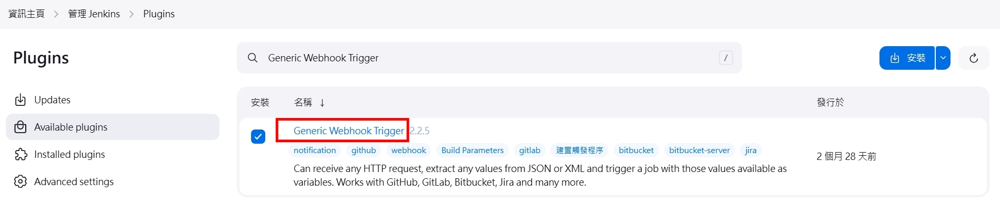
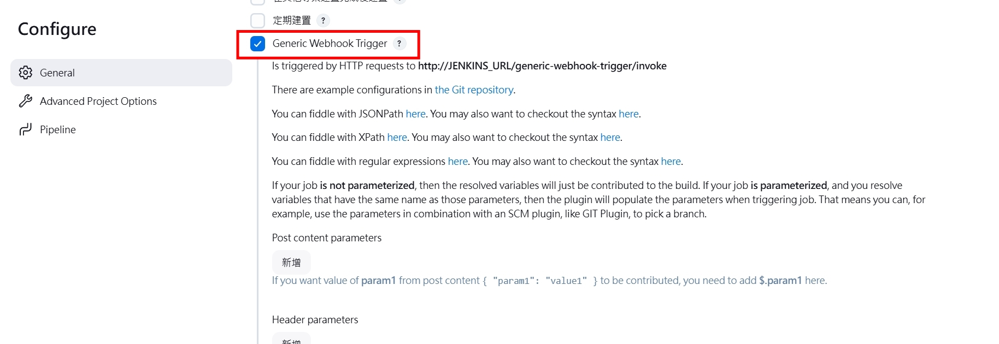
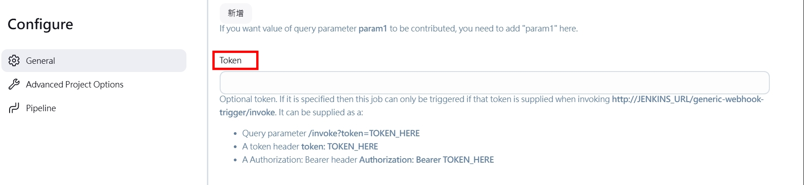
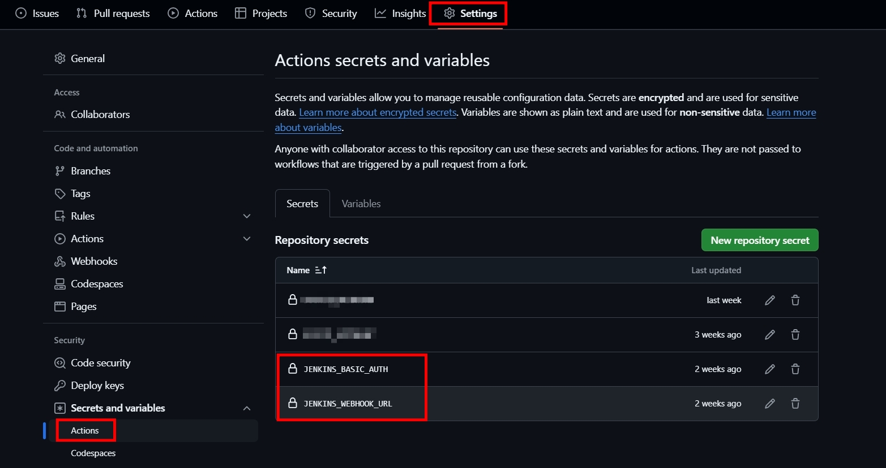

## 前言

在持續集成和持續交付 (CI/CD) 流程中，Webhook 是一種常用的觸發機制。本文將介紹如何在 Jenkins 中使用 Generic Webhook Trigger 插件來設置和使用 Webhook 調用功能，以便在特定事件發生時自動觸發 Jenkins 任務。

## 步驟

### 安裝 Generic Webhook Trigger 插件

進入 Manage Jenkins > Available plugins 安裝 Generic Webhook Trigger Plugin。

 </br>

### 配置 Jenkins 任務

創建或打開一個現有的 Jenkins 作業，在 Jenkins 作業中啟用 Generic Webhook Trigger。

 </br>

設定 Webhook Token，這邊設定為 echo -n "username:password" | base64 產生的值。

 </br>

### 配置 Webhook URL (以 GitHub Actions 為範例)

在 GitHub Actions secrets and variables 設定 Secrets。 </br>
JENKINS_WEBHOOK_URL 設定為 http://JENKINS_URL/generic-webhook-trigger/invoke 。 </br>
JENKINS_BASIC_AUTH 設定為上述產生的 Webhook Token。

 </br>

以 GitHub Action 使用 Post 呼叫 Jenkins 啟動。

```yaml
jobs:
  build:
    runs-on: ubuntu-latest

    steps:
    - name: Notify Jenkins to deploy Docker image
      run: |
        curl -X POST ${{ secrets.JENKINS_WEBHOOK_URL }} \
        -H "Authorization: Bearer ${{ secrets.JENKINS_BASIC_AUTH }}"
```